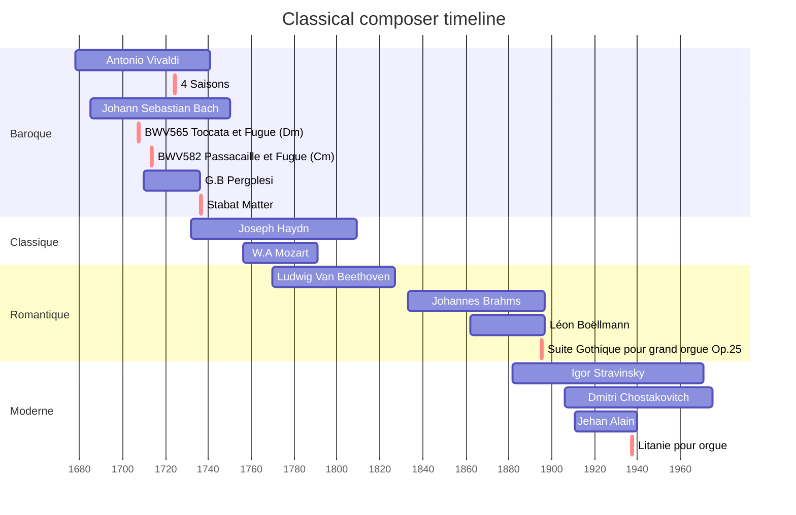

```mermaid
gantt

title Classical composer timeline
axisFormat %Y

dateFormat YYYY

section Baroque
Antonio Vivaldi		:1678,1741
4 Saisons				:crit,1724,1725
Johann Sebastian Bach	:1685,1750
BWV565 Toccata et Fugue (Dm)			:crit,1707,365d
BWV582 Passacaille et Fugue (Cm)			:crit,1713,365d
G.B Pergolesi 	:1710,1736
Stabat Matter	:crit,1736,365d


section Classique
Joseph Haydn			:1732,1809
W.A Mozart	:1756,1791

section Romantique
Ludwig Van Beethoven	:1770,1827
Johannes Brahms			:1833,1897
Léon Boëllmann			:1862,1897
Suite Gothique pour grand orgue Op.25:crit,1895,365d


section Moderne
Igor Stravinsky			:1882,1971
Dmitri Chostakovitch	:1906,1975
Jehan Alain				:1911,1940
Litanie pour orgue		:crit,1937,365d


```
